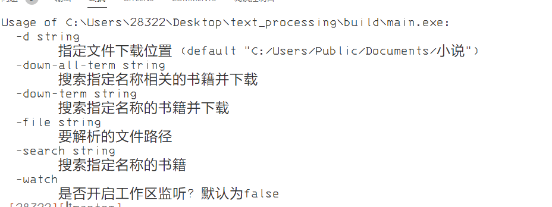
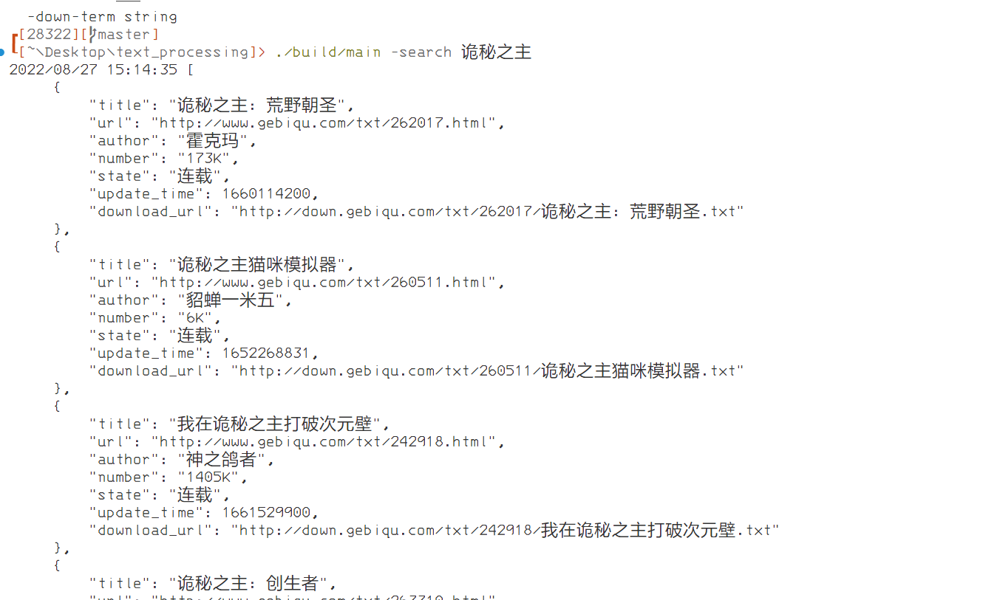
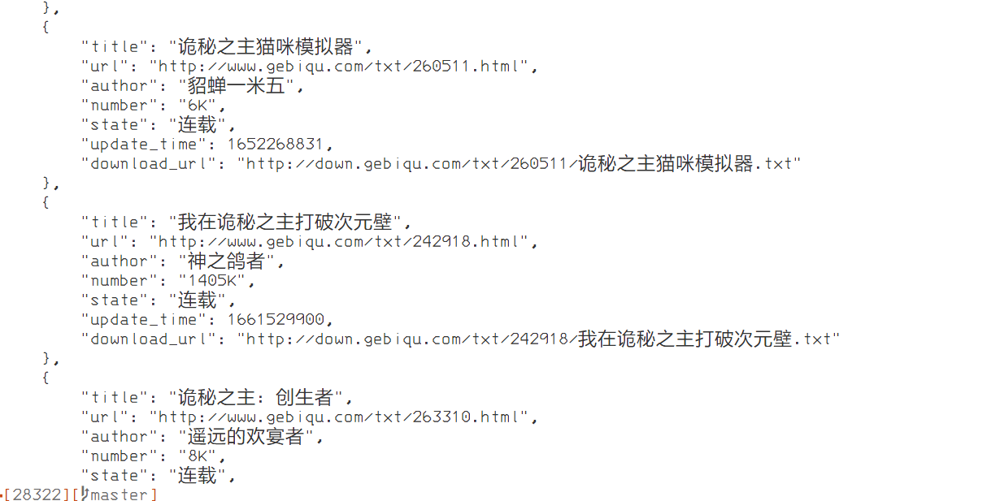

## 前言

如果要构建项目请先

```bash
go mod tidy
```

这是一个写作的工具集，包含了书籍搜索，书籍下载，批量下载。

## 如何使用？

1. 下载源代码从代码中构建

   ```shell
   git clone https://github.com/aiShuiJiaoDeXioShou/text_processing.git
   go mod tidy
   go build src btools.go
   或者
   go mod tidy
   ./build.sh
   ```
2. 下载现成的

   [windows btools.exe](https://github.com/aiShuiJiaoDeXioShou/text_processing/raw/d29312c2aa59590ed04ceeba1722a239d99d7722/build/main.exe)

## 使用手册

书籍信息的统计，章节信息的分析。

最新版本功能列表如下：






